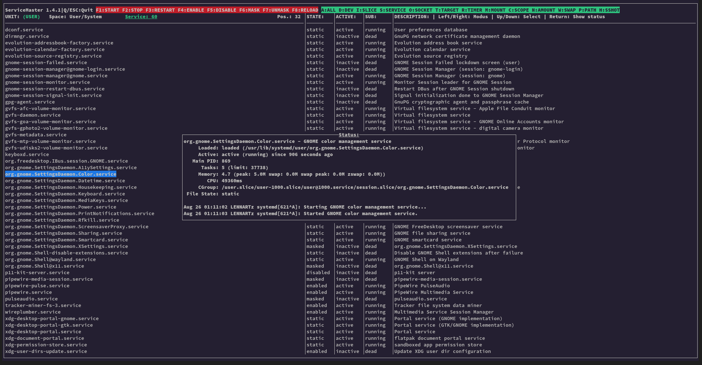

# ServiceMaster

ServiceMaster is a powerful terminal-based tool for managing systemd units on Linux systems. It provides an intuitive interface for viewing and controlling system and user units, making it easier to manage your units without leaving the command line.

## Features

- View all systemd units or filter by type (services, devices, sockets, etc.)
- Start, stop, restart, enable, disable, mask, and unmask units
- View detailed status information for each unit
- Switch between system and user units
- User-friendly ncurses interface with color-coded information
- Keyboard shortcuts for quick navigation and control

## Requirements

- Linux system with systemd
- NCurses library
- Systemd development libraries

## Usage

After launching ServiceMaster, you can use the following controls:

- Arrow keys, page up/down: Navigate through the list of units
- Space: Toggle between system and user units
- Enter: Show detailed status of the selected unit
- F1-F8: Perform actions (start, stop, restart, etc.) on the selected unit
- A-Z: Quick filter units by type
- Q or ESC: Quit the application

## Security Note

For security reasons, only root can manipulate system units, and only user units can be manipulated when running as a regular user.

## License

This project is licensed under the MIT License. See the [LICENSE](LICENSE) file for details.

## Author

Lennart Martens

## Contact

For bug reports, feature requests, or general inquiries:
- Email: monkeynator78@gmail.com
- GitHub: [https://github.com/lennart1978/servicemaster](https://github.com/lennart1978/servicemaster)

## Version

1.2

Build:
```bash
mkdir builddir && meson setup builddir && cd builddir && meson compile
```
Run:
```bash
./servicemaster
```
Have fun !

</img>
</img>
